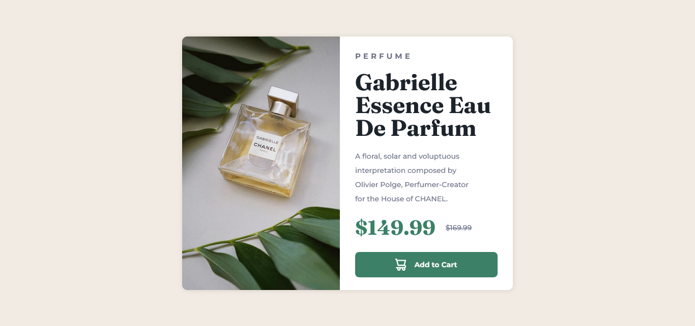
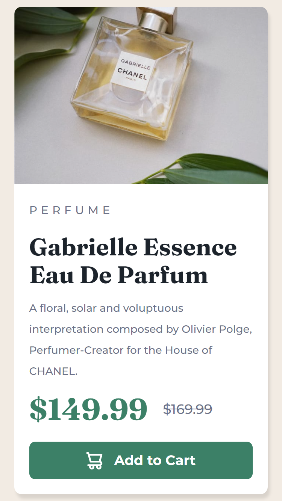

# Frontend Mentor - Product preview card component

Esta es una solución al desafío [Product preview card component](https://www.frontendmentor.io/challenges/product-preview-card-component-GO7UmttRfa) de Frontend Mentor. Los desafíos de Frontend Mentor nos ayudan a mejorar nuestras habilidades de codificación mediante el desarrollo de proyectos reales.

## Tabla de contenidos

- Visión general
  - El desafío
  - Capturas de pantalla
  - Enlaces
- Proceso de trabajo
  - Planeación
  - Análisis
  - Desarrollo
  - Pruebas
  - Lo que aprendí
  - Lo que aprenderé
  - Recursos útiles
- Autor
- Agradecimientos

## Visión general

### El desafío

Los usuarios deben ser capaces de:

- Ver el diseño óptimo según el tamaño de pantalla del dispositivo
- Ver estados hover y desplazamiento de los elementos interactivos

### Capturas de pantalla

Visualización de la página web en computadoras y teléfonos:




### Enlaces

- Código fuente: [Product preview card component](https://your-solution-url.com)
- Sitio web: [Product preview card component](https://your-solution-url.com)

## Proceso de trabajo

### Planeación

En esta fase analizamos los requerimientos del proyecto para ser coherentes con el proceso de trabajo.

Recursos para el proyecto:
- Editor de código (Visual Studio Code)
- Navegadores (Google, Firefox y Opera)
- Sistema de control de versiones (Git & GitHub)
- Hosting gratuito (Vercel)

Tiempo estimado del proyecto:
- 1 día (desarrollo)
- 1 día (documentación)

### Análisis

Analizamos los objetivos del proyecto, para ofrecer contenido relevante para usuarios que aman los perfumes y el cuidado personal. También, analizamos los diseños del proyecto para tener una visión clara de cómo abordarlo.

### Desarrollo

- **Entorno**: preparamos el entorno adecuado para el desarrollo del proyecto: carpetas, recursos y complementos.
- **Estructura**: analizamos minuciosamente el diseño para comenzar a marcar el documento HTML.
- **Estilos**: creamos los estilos base y reutilizables, también los estilos para cada elemento.
- **De arriba hacia abajo**: empezamos marcando el documento HTML de arriba hacia abajo, hacemos lo mismo con los estilos CSS. Usar este método nos permite enfocarnos y usar buenas prácticas para tener un buen código.

El proyecto demandó:
- Marcado semántico HTML con la metodología BEM (Block, Element, Modifiers)
- Propiedades y variables CSS
- Flexbox
- Flujo de trabajo mobile-first
- Archivo Normalize.css

### Pruebas

Aunque el proyecto es pequeño, siempre realizamos pruebas en herramientas como: PageSpeed Insights para mejorar la velocidad de carga. También hacemos uso de Google Developer Tools para analizar la performance de la página e identificar mejoras.

### Lo que aprendí

Esta es una lista de las cosas que aprendí:
- Elemento HTML `<picture>`
- Metodología BEM
- Normalize
- Variables CSS
***
El [elemento HTML `<picture>`](https://www.w3schools.com/html/html_images_picture.asp) permite mostrar diferentes imágenes para diferentes dispositivos o tamaños de pantalla.

**Ejemplo**
```html
<picture class="card__picture">
  <source media="(min-width: 1020px)" srcset="images/image-product-desktop.jpg">
  <source media="(min-width: 375px)" srcset="images/image-product-mobile.jpg">
  
</picture>
```

> **Nota:** siempre especifique un elemento `` como último elemento secundario dentro de `<picture>`. El elemento `` lo utilizan los navegadores que no admiten elementos `<picture>`, o si ninguna de las etiquetas `<source>` coincide.
***

[BEM](https://en.bem.info/methodology/quick-start/) (Block - Elements - Modifiers)  
Es un enfoque basado en componentes para el desarrollo web. La idea detrás de esto es dividir la interfaz de usuario en bloques independientes. Esto hace que el desarrollo de la interfaz sea fácil y rápido, incluso con una interfaz de usuario compleja, y permite la reutilización del código existente sin copiar y pegar.

**Block**  
Un componente de página funcionalmente independiente que se puede reutilizar. En HTML, los bloques están representados por el atributo de clase. El nombre del bloque describe su propósito ("¿Qué es?": menú o botón), no su estado ("¿Qué aspecto tiene?": rojo o grande).  
**Ejemplo:**
```html
<!-- Correcto. El bloque `error` es semanticamente significativo -->
<div class="error"></div>

<!-- Incorrecto. Describe la apariencia -->
<div class="red-text"></div>
```

**Element**  
Una parte compuesta de un bloque que no se puede usar por separado.  
El nombre del elemento describe su propósito ("¿Qué es?": elemento, texto, etc), no su estado ("¿Qué aspecto tiene?": rojo o grande).  
La estructura del nombre completo de un elemento es `block__element-name`. El nombre del elemento se separa del nombre de bloque con doble guión bajo (__).  
**Ejemplo:**
```html
<!-- Bloque `search-form` -->
<form class="search-form">
    <!-- Elemento `input` en el bloque `search-form` -->
    <input class="search-form__input">

    <!-- Elemento `button` en el bloque `search-form` -->
    <button class="search-form__button">Search</button>
</form>
```

**Modifier**  
Una entidad que define la apariencia, el estado o el comportamiento de un bloque o elemento.  
El nombre del modificador describe su apariencia ("¿Qué tamaño?", "¿Qué color?", etc), su estado ("¿En qué se diferencia de los demás?": deshabilitado, enfocado, etc.) y su comportamiento ("¿Cómo se comporta?" o "¿Cómo responde al usuario?").  
El nombre del modificador está separado del nombre del bloque o elemento por un solo guión bajo (_).  
**Ejemplo:**
```html
<!-- El bloque `search-form` tiene el modificador booleano `focused` -->
<form class="search-form search-form_focused">
    <input class="search-form__input">

    <!-- El elemento `button` tiene el modificador booleano `disabled` -->
    <button class="search-form__button search-form__button_disabled">Search</button>
</form>
```
***

[Normalize CSS](https://necolas.github.io/normalize.css/) hace que los navegadores representen todos los elementos de manera más consistente y en línea con los estándares modernos. Se dirige con precisión solo a los estilos que necesitan normalizarse.
***

Las variables CSS son propiedades que puedes personalizar para almacenar valores que se utilizan constantemente.  
**Ejemplo:**
```css
:root {
  /* Colores primarios*/
  --dark-cyan-color: hsl(158, 36%, 37%);
  --cream-color: hsl(30, 38%, 92%);

  /* Colores neutrales */
  --very-dark-blue: hsl(212, 21%, 14%);
  --dark-grayish-blue: hsl(228, 12%, 48%);
  --white-color: hsl(0, 0%, 100%);

  /* Fuentes */
  --fuente-montserrat: 'Montserrat', sans-serif;
  --fuente-fraunces: 'Fraunces', serif;
}
```

### Lo que aprenderé

Profundizar y aprender más:
- BEM (Block - Element - Modifier)
- Pre-procesador SASS
- Etiquetas OpenGraph
- Flexbox
- CSS Grid

### Recursos útiles

Estos recursos me ayudaron a realizar un mejor trabajo para finalizar el proyecto:

- [Picture element](https://www.w3schools.com/html/html_images_picture.asp) - este sitio me ayudó a comprender cómo usar el elemento HTML `<picture>`. Lo recomiendo ampliamente.
- [BEM](https://en.bem.info/methodology/quick-start/) - este sitio me ayudó a comprender el propósito de la metodología BEM.
- [Learn BEM with CSS Examples (From Real Websites)](https://scalablecss.com/bem-css-examples/) - este sitio fue un excelente complemento para entender BEM, porque tiene ejemplos de sitios web reales.

## Autor

El aprendizaje es un proceso social, conecta conmigo para hablar del siguiente proyecto:

- [LinkedIn](https://www.linkedin.com/in/xantosromero)
- [Frontend Mentor](https://www.frontendmentor.io/profile/xantosromerodev)
- [GitHub](https://github.com/xantosromerodev)
- [Dev](https://dev.to/xantosromero)

Puedes enviarme un mensaje por cualquier red social. Estaré feliz de conocerte.

## Agradecimientos

Quiero agradecer a mi amigo Hernán Sicha que se reuné conmigo todos los días para codificar durante dos horas, ha sido una motivación y un aliado para mantener la disciplina y terminar el proyecto.  

También agradecer a Matt de Frontendmentor por haber creado una excelente plataforma con retos para ayudar a mejorar las habilidades de millones de desarrolladores web en todo el mundo.

¡Feliz aprendizaje!🙌